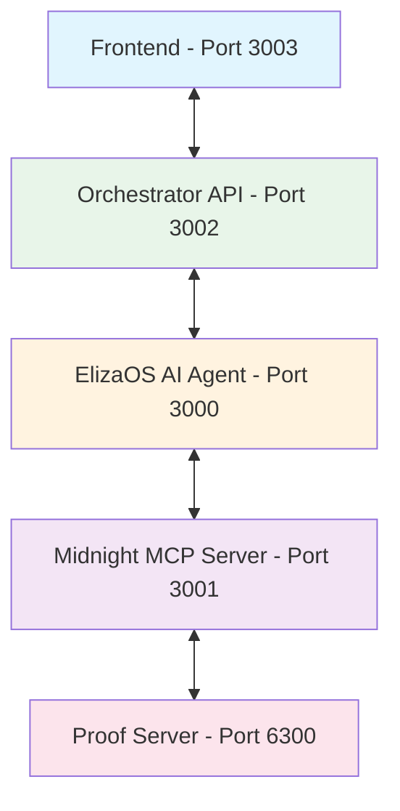

# Midnight-OS Organization


## Reimagining DAO Treasury Management with AI

Welcome to **Midnight-OS**, where we are building the future of decentralized autonomous organization (DAO) treasury management. Our platform combines cutting-edge artificial intelligence with blockchain technology to create secure, privacy-preserving, and automated treasury management solutions.

## Our Mission

To democratize access to advanced treasury management tools by providing AI-powered solutions that make complex blockchain operations accessible through natural language interactions. We believe in a future where DAOs can operate efficiently, transparently, and securely without requiring deep technical expertise.

## Core Technology Stack

### Artificial Intelligence
- **ElizaOS Framework**: Advanced conversational AI for natural language blockchain operations
- **Multi-Model Support**: Integration with OpenAI, Anthropic, and local AI models
- **Plugin Architecture**: Extensible system for adding new capabilities

### Blockchain Infrastructure
- **Midnight Network**: Privacy-focused blockchain with zero-knowledge proof capabilities
- **Model Context Protocol (MCP)**: Bridging AI and blockchain operations
- **Smart Contracts**: Automated treasury management and governance

### Platform Architecture
- **Multi-Agent System**: Deploy specialized AI agents for different organizational roles
- **Microservices Architecture**: Scalable, maintainable, and resilient system design
- **Container Orchestration**: Docker-based deployment for consistent environments

## Key Projects

### MidnightOS Platform
**Repository**: [MidnightOS](https://github.com/Midnight-OS/MidnightOS)

The main platform repository containing:
- Frontend web application (Next.js)
- Platform orchestrator API
- ElizaOS AI agent integration
- Midnight MCP blockchain server
- Documentation and deployment configurations

### Features
- **AI-Powered Treasury Management**: Automated proposal creation, fund allocation, and financial decision-making
- **Zero-Knowledge Proofs**: Privacy-preserving transactions on Midnight blockchain
- **Natural Language Interface**: Execute complex blockchain operations through conversation
- **Multi-Tenancy**: Support for multiple organizations on a single platform
- **Comprehensive Tools**: 26+ specialized blockchain tools for complete DAO management

## Use Cases

### DAO Treasury Management
- Automated fund allocation based on governance decisions
- Intelligent proposal evaluation and recommendation
- Real-time treasury analytics and reporting
- Multi-signature wallet management

### Governance Automation
- Natural language proposal creation
- Automated voting execution
- Transparent decision tracking
- Community engagement analytics

### Privacy-Preserving Operations
- Shielded transactions for sensitive operations
- Zero-knowledge proof generation
- Private voting mechanisms
- Confidential treasury management

## Getting Started

### For Users
1. Visit our [documentation](https://github.com/Midnight-OS/MidnightOS#readme)
2. Follow the installation guide
3. Deploy your first AI-powered treasury bot
4. Start managing your DAO with natural language commands

### For Developers
```bash
# Clone the repository
git clone https://github.com/Midnight-OS/MidnightOS.git

# Install dependencies
cd MidnightOS && pnpm install

# Start development environment
pnpm dev
```

## Architecture Overview



## Community and Support

### Connect With Us
- **GitHub Issues**: [Report bugs or request features](https://github.com/Midnight-OS/MidnightOS/issues)
- **Discussions**: [Join the conversation](https://github.com/Midnight-OS/MidnightOS/discussions)
- **Documentation**: [Read the docs](https://github.com/Midnight-OS/MidnightOS/blob/main/README.md)

### Contributing
We welcome contributions from the community! Whether you're fixing bugs, adding features, or improving documentation, your help makes MidnightOS better for everyone.

1. Fork the repository
2. Create your feature branch
3. Commit your changes
4. Push to the branch
5. Open a Pull Request

### Code of Conduct
We are committed to providing a welcoming and inspiring community for all. Please read and follow our Code of Conduct to help us maintain a positive environment.

## Technology Partners

We are proud to work with leading technologies:
- [ElizaOS](https://github.com/elizaos/elizaos) - AI agent framework
- [Midnight Network](https://midnight.network) - Privacy-focused blockchain
- [Model Context Protocol](https://modelcontextprotocol.io) - AI-blockchain bridge
- [Supabase](https://supabase.com) - Backend infrastructure
- [Next.js](https://nextjs.org) - React framework

## Security

Security is our top priority. Our platform implements:
- End-to-end encryption for sensitive data
- Zero-knowledge proofs for privacy
- Multi-signature wallet support
- Regular security audits
- Bug bounty program (coming soon)

## Roadmap

### Q1 2025
- Launch mainnet version
- Mobile application development
- Advanced AI model integration
- Cross-chain treasury management

### Q2 2025
- Hardware wallet integration
- Advanced analytics dashboard
- Governance token launch
- Partnership announcements

### Q3 2025
- Multi-chain support
- AI agent marketplace
- Enterprise features
- Global expansion

## License

MidnightOS is open source software licensed under the MIT License. See [LICENSE](https://github.com/Midnight-OS/MidnightOS/blob/main/LICENSE) for more information.

## Acknowledgments

Built by a passionate team dedicated to democratizing DAO treasury management through artificial intelligence and blockchain technology.

---

**Midnight-OS** - Building the Future of DAO Treasury Management

*Secure. Private. Intelligent.*