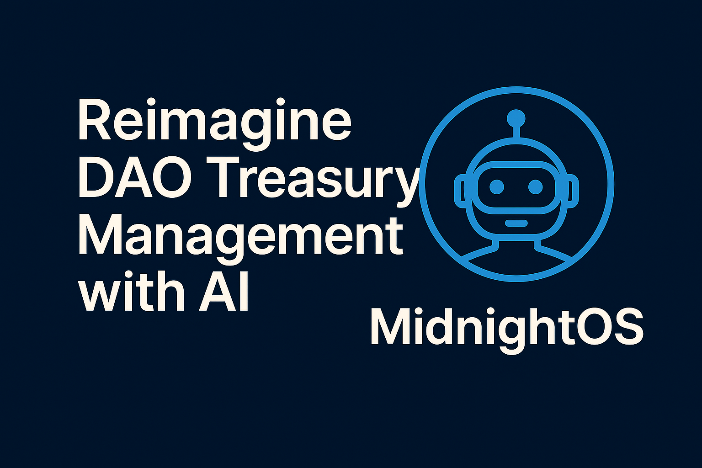
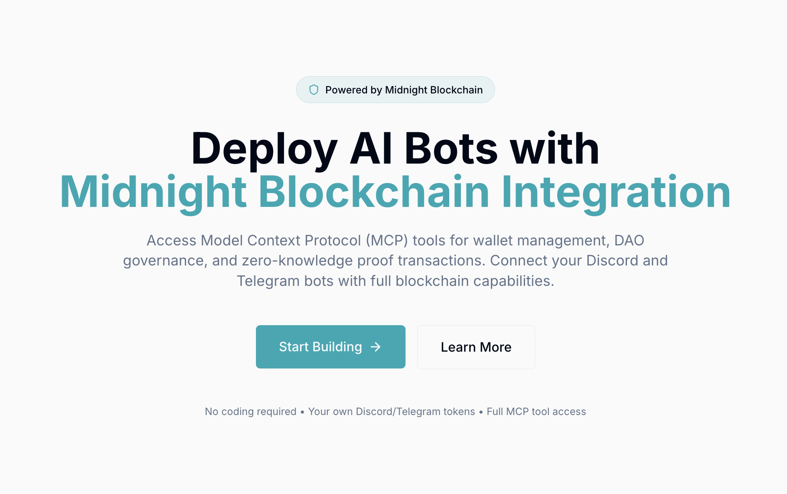
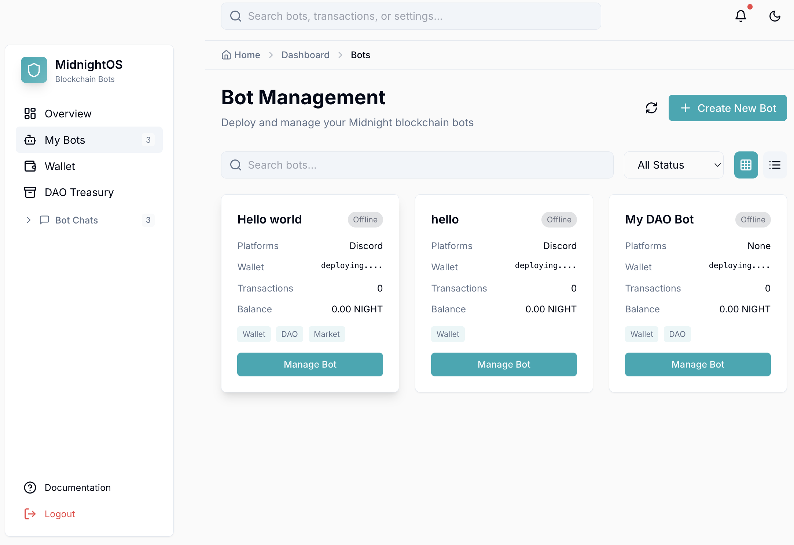
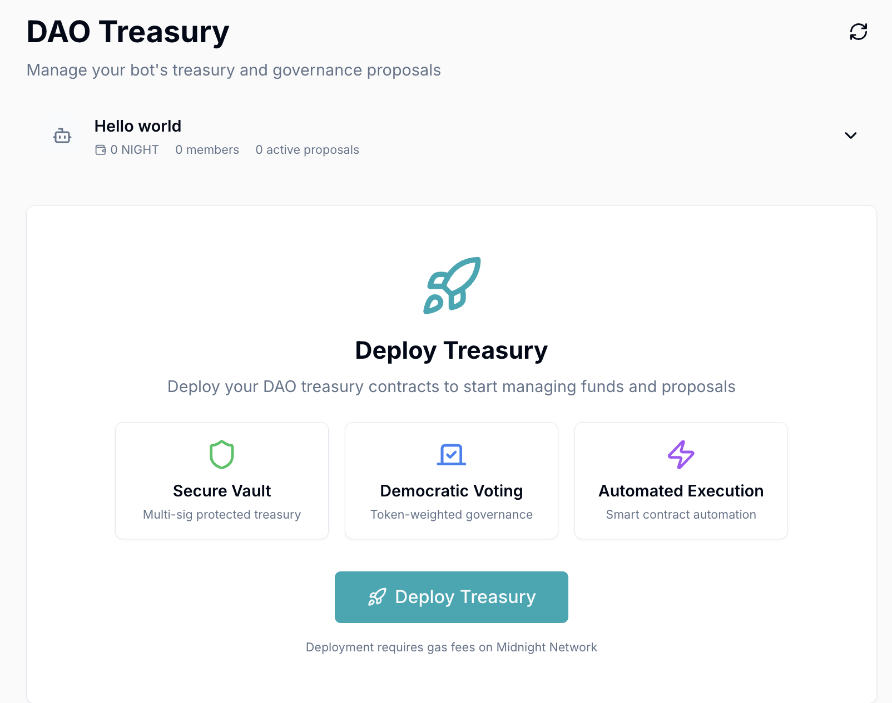
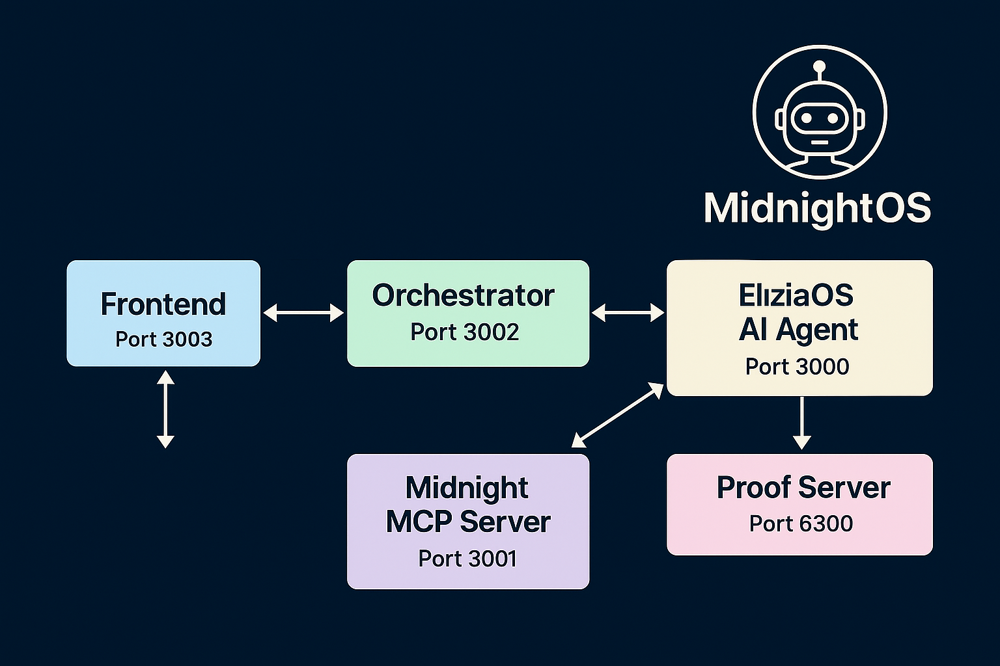

# MidnightOS



**Deploy AI bots on the Midnight blockchain with zero-knowledge privacy.**

MidnightOS lets you build and manage AI agents that can automate treasury operations, handle governance, and interact with users—all powered by Midnight's zero-knowledge technology. No blockchain expertise required.

The platform combines ElizaOS for conversational AI with Midnight's privacy-preserving infrastructure, giving you secure, autonomous bots that protect sensitive operations.

### Key Capabilities

- **Multi-Tenant Architecture** - Single shared infrastructure serving unlimited bot deployments
- **Zero-Knowledge Privacy** - Built on Midnight's ZK technology for confidential operations
- **Treasury Automation** - Autonomous DAO treasury management with governance integration
- **Multi-Platform Support** - Deploy to Discord, Telegram, Web, and custom platforms
- **Local Development** - Complete local testing environment before production deployment



## Platform Features

### Bot Management

Deploy and manage multiple AI bots from a unified dashboard. Create bots with custom personalities, connect them to Discord and Telegram, and monitor their performance in real-time.



### DAO Treasury Management

Deploy secure, multi-signature protected treasuries with democratic voting and automated execution. Built on Midnight's zero-knowledge smart contracts for complete privacy.



## Architecture

The platform consists of four primary layers:

1. **Frontend Layer** - Next.js web dashboard (Port 3000)
2. **API Layer** - Express.js orchestrator (Port 3002)
3. **AI Layer** - Multi-tenant Eliza server (Port 3004)
4. **Blockchain Layer** - Midnight MCP service (Port 3001)

### System Architecture


### API Architecture



For detailed architecture documentation, see [docs/architecture.md](docs/architecture.md).

## Quick Start

### Prerequisites

- Node.js 20+ and pnpm 10+
- Docker and Docker Compose
- PostgreSQL database
- Git

### Installation

```bash
# Clone repository
git clone https://github.com/your-org/MidnightOS.git
cd MidnightOS

# Install dependencies
pnpm install

# Initialize environment
cp .env.example .env
# Edit .env with your configuration

# Sync environment to all services
pnpm env:sync

# Start development environment
pnpm dev
```

### Docker Deployment

```bash
# Build and start all services
./scripts/docker-up.sh

# View logs
docker compose logs -f

# Stop services
./scripts/docker-down.sh
```

## Project Structure

```
MidnightOS/
├── docs/              # Comprehensive documentation
├── platform/
│   ├── frontend/      # Next.js web application
│   └── orchestrator/  # API server and bot management
├── services/
│   ├── eliza-agent/   # Multi-tenant AI server
│   └── midnight-mcp/  # Blockchain integration service
├── scripts/           # Deployment and utility scripts
└── docker/            # Docker configurations
```

## Documentation

### Getting Started
- [Quick Start Guide](docs/quickstart.md) - Complete setup instructions
- [User Guide](docs/user-guide.md) - Platform usage and features
- [Bot Builder Tutorial](docs/bot-builder.md) - Create and configure bots

### Technical Documentation
- [Architecture Overview](docs/architecture.md) - System design and components
- [API Reference](docs/api-reference.md) - Complete API documentation
- [Treasury Management](docs/treasury.md) - DAO treasury setup and automation

### Operations
- [Deployment Guide](docs/deployment.md) - Production deployment procedures
- [Troubleshooting](docs/troubleshooting.md) - Common issues and solutions
- [Scripts Reference](scripts/README.md) - Utility scripts documentation

## Development

### Running Services Locally

```bash
# Terminal 1: Start MCP service
cd services/midnight-mcp
PORT=3001 pnpm start

# Terminal 2: Start shared Eliza server
cd services/eliza-agent
pnpm start:server

# Terminal 3: Start orchestrator
cd platform/orchestrator
pnpm start

# Terminal 4: Start frontend
cd platform/frontend
pnpm dev
```

### Environment Configuration

The platform uses a centralized environment configuration system. See [ENVIRONMENT_SYNC.md](docs/ENVIRONMENT_SYNC.md) for details on managing environment variables across services.

### Testing

```bash
# Run all tests
pnpm test

# Run specific service tests
cd platform/orchestrator && pnpm test
cd services/eliza-agent && pnpm test
cd services/midnight-mcp && pnpm test
```

## Production Deployment

### Network Configuration

MidnightOS supports multiple Midnight network modes:

- **Undeployed** - Local development with embedded proof server
- **TestNet** - Midnight TestNet deployment
- **Standalone** - Self-hosted infrastructure

Switch between networks using the provided scripts:

```bash
# Switch to TestNet
./scripts/switch-to-testnet.sh

# Switch to Standalone
./scripts/switch-to-standalone.sh
```

### Security Considerations

- Store all private keys and seeds securely
- Use environment variables for sensitive configuration
- Enable authentication in production environments
- Review [docs/troubleshooting.md](docs/troubleshooting.md) for security best practices

**Note on Repository Credentials**: API keys and credentials present in this repository were included intentionally for demonstration and development purposes. All keys are valid but temporary and will be revoked. For production deployments, always use secure environment variable management and never commit sensitive credentials to version control.

## Technology Stack

- **Frontend**: Next.js 15, React 18, TailwindCSS
- **Backend**: Node.js, Express.js, Prisma ORM
- **AI**: ElizaOS, OpenAI API
- **Blockchain**: Midnight Network, Zero-Knowledge Proofs
- **Database**: PostgreSQL
- **Deployment**: Docker, Docker Compose

## Contributing

We welcome contributions to MidnightOS. Please review our contribution guidelines and submit pull requests to the main repository.

## Support

- **Documentation**: [docs/](docs/)
- **Issues**: [GitHub Issues](https://github.com/your-org/MidnightOS/issues)
- **Community**: [Discord Server](https://discord.gg/midnightos)

## License

[License information to be added]

## Acknowledgments

Built for the Midnight blockchain ecosystem. Special thanks to the Midnight Labs team for their support and infrastructure.

---

**Version**: 1.0.0  
**Last Updated**: September 2025  
**Status**: Production Ready
