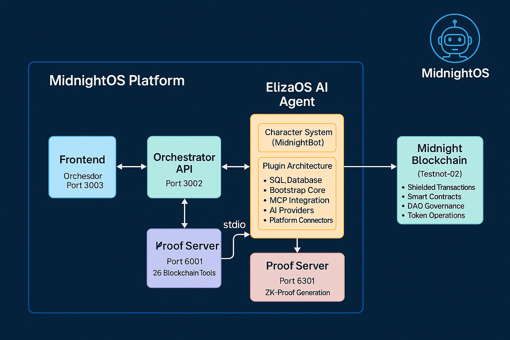

# MidnightOS


## Reimagine DAO Treasury Management with AI

MidnightOS is an advanced AI-powered platform for decentralized autonomous organization (DAO) treasury management, built on the Midnight blockchain with zero-knowledge proof capabilities. The platform combines ElizaOS artificial intelligence framework with blockchain operations to provide automated, secure, and privacy-preserving treasury management solutions.

## Table of Contents

- [Overview](#overview)
- [Architecture](#architecture)
- [Key Features](#key-features)
- [Technology Stack](#technology-stack)
- [System Requirements](#system-requirements)
- [Installation](#installation)
- [Configuration](#configuration)
- [Services](#services)
- [Development](#development)
- [API Documentation](#api-documentation)
- [Deployment](#deployment)
- [Security](#security)
- [Contributing](#contributing)
- [License](#license)

## Overview

MidnightOS revolutionizes how DAOs manage their treasuries by integrating artificial intelligence with blockchain technology. The platform enables organizations to automate complex financial operations, governance processes, and treasury management tasks through natural language interactions with AI agents.

### Core Capabilities

- **AI-Driven Treasury Management**: Automated proposal creation, fund allocation, and financial decision-making
- **Zero-Knowledge Proof Integration**: Privacy-preserving transactions and shielded operations on Midnight blockchain
- **Multi-Agent Architecture**: Deploy multiple specialized AI agents for different organizational roles
- **Real-Time Blockchain Operations**: Execute transactions, deploy contracts, and manage wallets through conversational AI
- **Decentralized Governance**: Automated voting, proposal management, and treasury fund distribution

## Architecture

### System Architecture


### API Architecture  


### System Architecture Diagram


### Component Architecture

#### Frontend Layer
- **Technology**: Next.js 15, TypeScript, TailwindCSS
- **Purpose**: User interface for bot management, treasury operations, and DAO governance
- **Features**: Real-time chat, wallet management, proposal creation, voting interface

#### Orchestrator Service
- **Technology**: Express.js, Prisma ORM, Docker SDK
- **Purpose**: Platform orchestration, user management, container lifecycle management
- **Responsibilities**:
  - User authentication and authorization
  - Bot instance management
  - Multi-tenancy support
  - Container orchestration

#### ElizaOS AI Agent
- **Framework**: ElizaOS v1.5.15
- **Purpose**: Conversational AI for blockchain operations
- **Components**:
  - Character system for personality and behavior
  - Plugin architecture for extensibility
  - MCP integration for blockchain tools
  - Multi-model AI support (OpenAI, Anthropic, Ollama)

#### Midnight MCP Server
- **Protocol**: Model Context Protocol (MCP)
- **Purpose**: Bridge between AI and blockchain
- **Capabilities**:
  - 26 specialized blockchain tools
  - Wallet management
  - DAO operations
  - Treasury management
  - Smart contract deployment

#### Proof Server
- **Technology**: Midnight ZK-proof system
- **Purpose**: Generate zero-knowledge proofs for private transactions
- **Features**: Local proof generation, shielded operations support

## Key Features

### 1. AI-Powered DAO Management
- Natural language interaction for complex blockchain operations
- Automated proposal creation and management
- Intelligent treasury fund allocation
- Real-time voting and governance execution

### 2. Privacy-Preserving Operations
- Zero-knowledge proof integration
- Shielded transactions for anonymity
- Private state management
- Confidential voting mechanisms

### 3. Multi-Agent System
- Deploy multiple specialized AI agents
- Role-based agent configuration
- Cross-agent communication
- Parallel task execution

### 4. Comprehensive Blockchain Tools
- **Wallet Operations**: Balance checking, transfers, transaction history
- **DAO Governance**: Proposal creation, voting, result tracking
- **Treasury Management**: Fund allocation, payout processing, analytics
- **Smart Contracts**: Deployment, interaction, verification
- **Token Operations**: Minting, burning, transfers, registration

### 5. Enterprise Features
- Multi-tenancy support
- Role-based access control
- Audit logging
- Performance monitoring
- Scalable architecture

## Technology Stack

### Core Technologies
- **Runtime**: Node.js v20+, TypeScript 5.2+
- **Package Manager**: pnpm v10.15.0
- **Database**: PostgreSQL, Prisma ORM
- **Blockchain**: Midnight Network (Testnet-02)

### Frontend
- **Framework**: Next.js 15.0.0
- **UI Components**: Radix UI, Shadcn/ui
- **Styling**: TailwindCSS
- **State Management**: React Context, TanStack Query
- **Authentication**: Supabase Auth

### Backend Services
- **ElizaOS**: v1.5.15 - AI agent framework
- **MCP Server**: Model Context Protocol implementation
- **Orchestrator**: Express.js API server
- **Proof Server**: Midnight ZK-proof generation

### Blockchain Integration
- **Midnight SDK**: v2.0.2
- **Wallet**: Midnight Wallet v5.0.0
- **Smart Contracts**: Compact language
- **Network**: Testnet-02 endpoints

### Development Tools
- **Containerization**: Docker, Docker Compose
- **Testing**: Jest, Supertest
- **Linting**: ESLint, Prettier
- **Monitoring**: OpenTelemetry, Pino logging

## System Requirements

### Minimum Requirements
- **CPU**: 4 cores
- **RAM**: 8GB
- **Storage**: 20GB available space
- **OS**: macOS, Linux, Windows (WSL2)
- **Node.js**: v20.0.0 or higher
- **pnpm**: v10.15.0 or higher

### Recommended Requirements
- **CPU**: 8 cores
- **RAM**: 16GB
- **Storage**: 50GB SSD
- **Network**: Stable internet connection for blockchain sync

## Installation

### Prerequisites

1. Install Node.js (v20+):
```bash
curl -fsSL https://fnm.vercel.app/install | bash
fnm use 20
```

2. Install pnpm:
```bash
npm install -g pnpm@10.15.0
```

3. Install Docker (for containerized deployment):
```bash
# macOS
brew install docker docker-compose

# Linux
curl -fsSL https://get.docker.com | sh
```

### Quick Start

1. Clone the repository:
```bash
git clone https://github.com/Midnight-OS/MidnightOS.git
cd MidnightOS
```

2. Install dependencies:
```bash
pnpm install
```

3. Set up environment variables:
```bash
# Copy environment templates
cp .env.example .env

# Configure services
cd services/midnight-mcp && cp .env.example .env
cd ../eliza-agent && cp .env.example .env
cd ../../platform/orchestrator && cp .env.example .env
cd ../frontend && cp .env.example .env.local
```

4. Generate Prisma clients:
```bash
cd platform/orchestrator && pnpm prisma generate
cd ../../services/midnight-mcp && pnpm prisma generate
```

5. Build all services:
```bash
pnpm build
```

6. Start the platform:
```bash
# Start individual services
cd services/midnight-mcp && pnpm dev    # Terminal 1
cd platform/orchestrator && pnpm dev    # Terminal 2
cd services/eliza-agent && pnpm dev     # Terminal 3
cd platform/frontend && pnpm dev        # Terminal 4

# Or use Docker Compose
docker-compose up
```

## Configuration

### Environment Variables

#### Midnight MCP Service
```env
DATABASE_URL=            # Prisma database connection
NODE_ENV=development
PORT=3001
AGENT_ID=agent-001
USE_EXTERNAL_PROOF_SERVER=true
PROOF_SERVER=http://localhost:6300
INDEXER=https://indexer.testnet-02.midnight.network/api/v1/graphql
INDEXER_WS=wss://indexer.testnet-02.midnight.network/api/v1/graphql/ws
MN_NODE=https://rpc.testnet-02.midnight.network
```

#### ElizaOS Agent
```env
AGENT_ID=midnight-bot-agent
OPENAI_API_KEY=          # Optional: OpenAI API key
ANTHROPIC_API_KEY=       # Optional: Anthropic API key
DISCORD_TOKEN=           # Optional: Discord bot token
TELEGRAM_BOT_TOKEN=      # Optional: Telegram bot token
```

#### Orchestrator
```env
DATABASE_URL=            # PostgreSQL connection string
JWT_SECRET=              # JWT signing secret
PORT=3002
DOCKER_HOST=unix:///var/run/docker.sock
```

#### Frontend
```env
NEXT_PUBLIC_API_URL=http://localhost:3002
NEXT_PUBLIC_MCP_URL=http://localhost:3001
NEXT_PUBLIC_SUPABASE_URL=    # Supabase project URL
NEXT_PUBLIC_SUPABASE_ANON_KEY=  # Supabase anonymous key
```

### Network Configuration

The platform connects to Midnight Testnet-02:
- **RPC Endpoint**: https://rpc.testnet-02.midnight.network
- **Indexer GraphQL**: https://indexer.testnet-02.midnight.network/api/v1/graphql
- **WebSocket**: wss://indexer.testnet-02.midnight.network/api/v1/graphql/ws

## Services

### 1. Frontend (Port 3003)
Web interface for platform interaction
- Bot management dashboard
- Treasury operations interface
- Wallet management
- Chat interface for AI interaction

### 2. ElizaOS Agent (Port 3000)
AI agent service
- Natural language processing
- Blockchain operation execution
- Multi-model AI support
- Plugin system for extensibility

### 3. Midnight MCP Server (Port 3001)
Blockchain integration service
- 26 specialized tools for blockchain operations
- Wallet management
- DAO governance
- Smart contract deployment

### 4. Orchestrator (Port 3002)
Platform management API
- User authentication
- Bot lifecycle management
- Multi-tenancy support
- Container orchestration

### 5. Proof Server (Port 6300)
Zero-knowledge proof generation
- Local proof generation
- Shielded transaction support
- Privacy-preserving operations

## Development

### Project Structure
```
MidnightOS/
├── platform/
│   ├── frontend/          # Next.js web application
│   └── orchestrator/      # Platform API server
├── services/
│   ├── eliza-agent/       # ElizaOS AI agent
│   └── midnight-mcp/      # MCP blockchain server
├── docker/                # Docker configurations
├── docs/                  # Documentation
└── scripts/              # Utility scripts
```

### Development Workflow

1. **Local Development**:
```bash
# Start all services in development mode
pnpm dev

# Run tests
pnpm test

# Lint code
pnpm lint

# Format code
pnpm format
```

2. **Building**:
```bash
# Build all services
pnpm build

# Build specific service
cd services/midnight-mcp && pnpm build
```

3. **Testing**:
```bash
# Unit tests
pnpm test:unit

# Integration tests
pnpm test:integration

# E2E tests
pnpm test:e2e
```

## API Documentation

### API Flow Diagram


### Orchestrator API Endpoints

| Category | Method | Endpoint | Description |
|----------|--------|----------|-------------|
| **Authentication** ||||
| | POST | `/api/auth/register` | Register new user |
| | POST | `/api/auth/login` | User login |
| | POST | `/api/auth/logout` | User logout |
| | GET | `/api/auth/me` | Get current user |
| **Bot Management** ||||
| | GET | `/api/bots` | List user's bots |
| | POST | `/api/bots` | Create new bot |
| | GET | `/api/bots/:id` | Get bot details |
| | PUT | `/api/bots/:id` | Update bot |
| | DELETE | `/api/bots/:id` | Delete bot |
| | POST | `/api/bots/:id/start` | Start bot |
| | POST | `/api/bots/:id/stop` | Stop bot |
| **Chat** ||||
| | POST | `/api/chat` | Send message to bot |
| | GET | `/api/chat/:sessionId` | Get conversation history |

### MCP Server Tools

| Category | Tool | Description |
|----------|------|-------------|
| **Wallet** ||||
| | `wallet_status` | Get wallet sync status |
| | `wallet_address` | Get wallet address |
| | `wallet_balance` | Get balance |
| | `wallet_send` | Send transaction |
| **DAO** ||||
| | `dao_proposal_create` | Create proposal |
| | `dao_vote` | Cast vote |
| | `dao_proposals` | List proposals |
| | `dao_state` | Get DAO state |
| **Treasury** ||||
| | `treasury_balance` | Get treasury balance |
| | `treasury_fund` | Fund treasury |
| | `treasury_payout` | Process payout |
| | `treasury_analytics` | Get analytics |

## Deployment

### Docker Deployment

1. **Build Docker images**:
```bash
docker-compose build
```

2. **Start services**:
```bash
docker-compose up -d
```

3. **Monitor logs**:
```bash
docker-compose logs -f
```

### Production Deployment

1. **Environment Setup**:
- Configure production environment variables
- Set up SSL certificates
- Configure domain names
- Set up database backups

2. **Security Configuration**:
- Enable authentication
- Configure CORS policies
- Set up rate limiting
- Enable monitoring

3. **Scaling Considerations**:
- Use container orchestration (Kubernetes)
- Implement load balancing
- Set up database replication
- Configure caching layers

## Security

### Security Features
- JWT-based authentication
- Role-based access control
- Encrypted wallet storage
- Zero-knowledge proofs for privacy
- Audit logging
- Rate limiting

### Security Best Practices
1. Never commit sensitive data (private keys, API keys)
2. Use environment variables for configuration
3. Enable HTTPS in production
4. Regular security audits
5. Keep dependencies updated
6. Monitor for suspicious activity

### Wallet Security
- Seed phrases are encrypted at rest
- Private keys never leave the secure enclave
- Multi-signature support for treasury operations
- Hardware wallet integration support

## Contributing

We welcome contributions to MidnightOS. Please follow these guidelines:

1. **Fork the repository**
2. **Create a feature branch**: `git checkout -b feature/your-feature`
3. **Commit changes**: `git commit -m 'Add new feature'`
4. **Push to branch**: `git push origin feature/your-feature`
5. **Submit a pull request**

### Code Standards
- Follow TypeScript best practices
- Write comprehensive tests
- Document new features
- Maintain consistent code style
- No emoji in codebase

### Commit Guidelines
- Use conventional commits format
- Write clear, descriptive messages
- Reference issues when applicable
- Include breaking changes documentation

## Support

### Documentation
- [User Guide](./docs/user-guide.md)
- [API Reference](./docs/api-reference.md)
- [Architecture Details](./docs/architecture.md)
- [Troubleshooting](./docs/troubleshooting.md)

### Community
- GitHub Issues: [Report bugs or request features](https://github.com/Midnight-OS/MidnightOS/issues)
- Documentation: [Read the docs](https://github.com/Midnight-OS/MidnightOS#readme)

## License

MidnightOS is licensed under the MIT License. See [LICENSE](./LICENSE) file for details.

## Acknowledgments

Built with:
- [ElizaOS](https://github.com/elizaos/elizaos) - AI agent framework
- [Midnight Network](https://midnight.network) - Privacy-focused blockchain
- [Model Context Protocol](https://modelcontextprotocol.io) - AI-blockchain bridge
- [Next.js](https://nextjs.org) - React framework
- [Supabase](https://supabase.com) - Backend as a service

---

**MidnightOS** - Reimagining DAO Treasury Management with AI

Version 1.0.0 | Built for the decentralized future