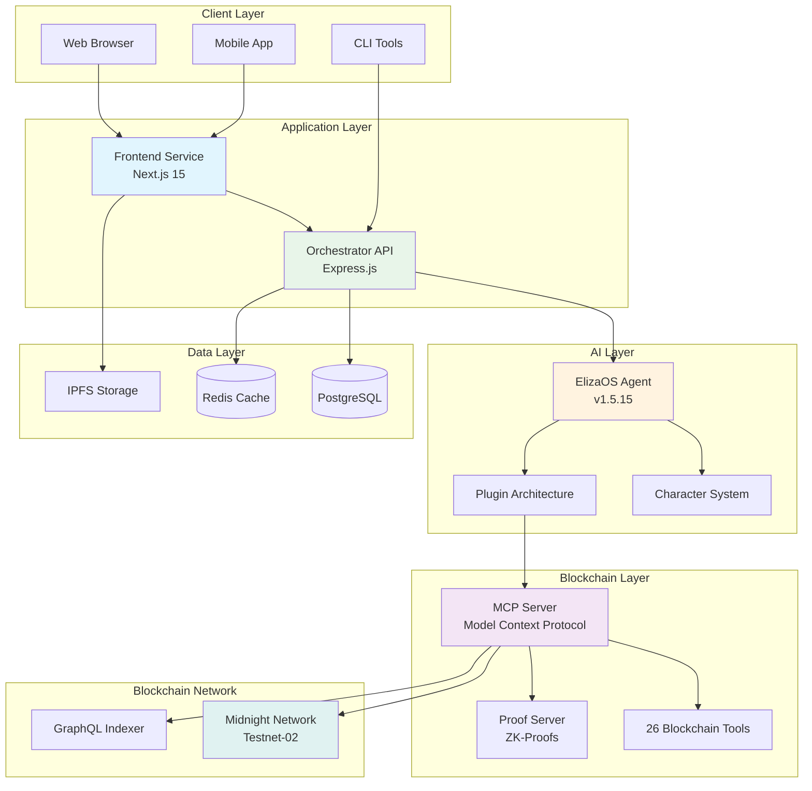
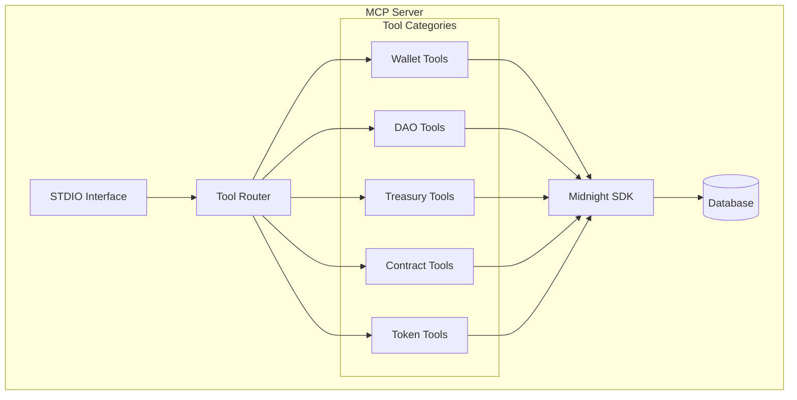
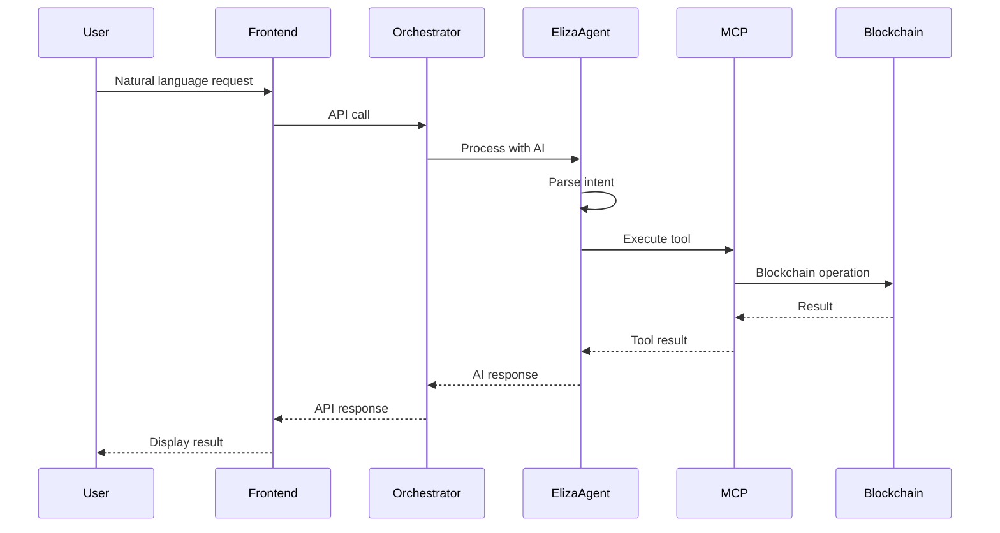
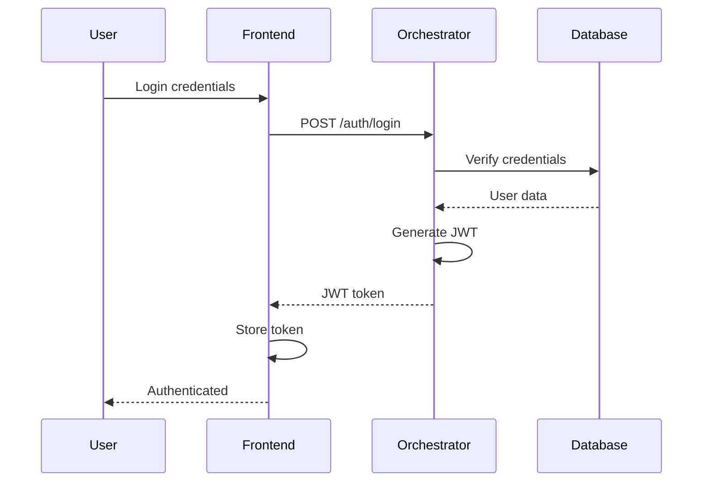
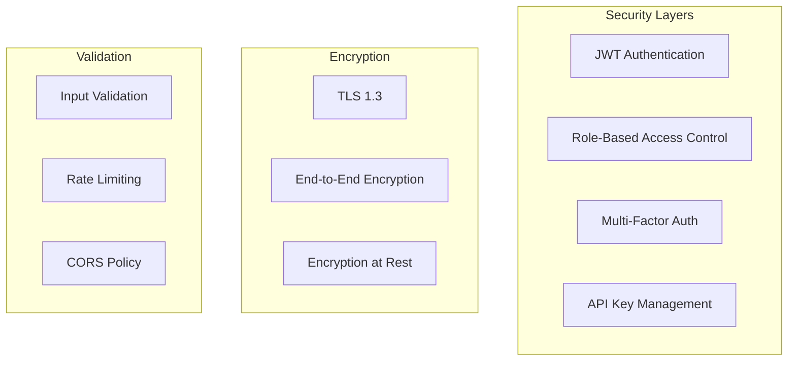
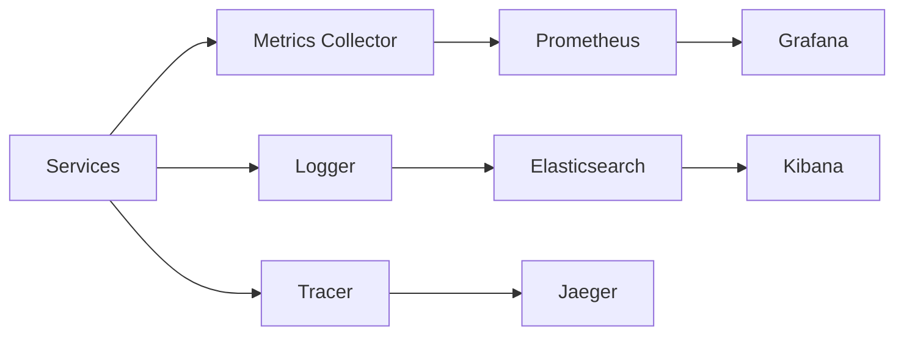
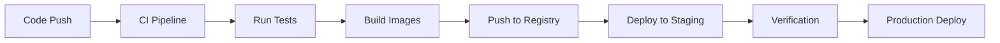

# MidnightOS Architecture

## System Overview

MidnightOS is a distributed microservices architecture designed for scalability, security, and extensibility. The platform integrates AI agents with blockchain operations through a modular design.

## Architecture Principles

### Design Philosophy
- **Separation of Concerns**: Each service has a single, well-defined responsibility
- **Loose Coupling**: Services communicate through well-defined interfaces
- **High Cohesion**: Related functionality is grouped together
- **Scalability**: Horizontal scaling through containerization
- **Security First**: Zero-trust architecture with encryption at rest and in transit

## System Components



## Service Architecture

### Frontend Service (Port 3003)

**Technology Stack:**
- Next.js 15.0.0 with App Router
- React 18 with Server Components
- TypeScript 5.2+
- TailwindCSS for styling
- Radix UI components

**Responsibilities:**
- User interface rendering
- Client-side state management
- WebSocket connections
- File uploads to IPFS
- PWA capabilities

**Key Features:**
- Server-side rendering for SEO
- Incremental static regeneration
- Edge runtime support
- Optimistic UI updates
- Real-time notifications

### Orchestrator API (Port 3002)

**Technology Stack:**
- Express.js framework
- Prisma ORM
- JWT authentication
- Docker SDK
- Bull queue system

**Responsibilities:**
- User authentication and authorization
- Bot lifecycle management
- Container orchestration
- Database operations
- API rate limiting

**Architecture Patterns:**
- Repository pattern for data access
- Service layer for business logic
- Middleware for cross-cutting concerns
- Event-driven architecture

### ElizaOS Agent (Port 3000)

**Technology Stack:**
- ElizaOS v1.5.15 framework
- TypeScript
- SQLite for local storage
- Plugin architecture

**Core Components:**

#### Character System
```typescript
interface Character {
  name: string;
  personality: string;
  knowledge: string[];
  skills: string[];
  goals: string[];
  background: string;
}
```

#### Plugin Architecture
1. **SQL Plugin**: Database operations
2. **Bootstrap Plugin**: Core functionality
3. **MCP Plugin**: Blockchain integration
4. **Model Plugins**: AI model providers
5. **Platform Plugins**: Discord, Telegram, etc.

**Processing Pipeline:**


### Midnight MCP Server (Port 3001)

**Technology Stack:**
- Node.js with TypeScript
- Model Context Protocol (MCP)
- Prisma with PostgreSQL
- Midnight SDK v2.0.2

**Architecture:**


**Tool Implementation:**
Each tool follows a standard interface:
```typescript
interface Tool {
  name: string;
  description: string;
  parameters: JSONSchema;
  execute(params: any): Promise<ToolResult>;
}
```

### Proof Server (Port 6300)

**Purpose:**
- Generate zero-knowledge proofs
- Validate private transactions
- Ensure transaction privacy

**Architecture:**
- Standalone service for proof generation
- Caches generated proofs
- Validates proof requests
- Integrates with Midnight protocol

## Data Flow

### Request Flow


### Authentication Flow


## Communication Protocols

### HTTP/REST
- Frontend ↔ Orchestrator
- External API integrations
- Webhook endpoints

### WebSocket
- Real-time updates
- Chat messages
- Transaction notifications

### STDIO
- ElizaAgent ↔ MCP Server
- Structured JSON messages
- Bidirectional communication

### GraphQL
- Blockchain indexer queries
- Efficient data fetching
- Real-time subscriptions

## Security Architecture

### Authentication & Authorization


### Security Measures
1. **Authentication**: JWT tokens with refresh mechanism
2. **Authorization**: Role-based access control (RBAC)
3. **Encryption**: TLS 1.3 for transport, AES-256 for storage
4. **Input Validation**: Schema validation, sanitization
5. **Rate Limiting**: Per-endpoint and per-user limits
6. **Audit Logging**: Comprehensive activity tracking

## Deployment Architecture

### Container Architecture
```yaml
services:
  frontend:
    image: midnightos/frontend:latest
    ports: ["3003:3003"]
    
  orchestrator:
    image: midnightos/orchestrator:latest
    ports: ["3002:3002"]
    
  eliza-agent:
    image: midnightos/eliza-agent:latest
    ports: ["3000:3000"]
    
  midnight-mcp:
    image: midnightos/mcp:latest
    ports: ["3001:3001"]
    
  proof-server:
    image: midnightos/proof:latest
    ports: ["6300:6300"]
```

### Scaling Strategy
- **Horizontal Scaling**: Multiple instances behind load balancer
- **Database Scaling**: Read replicas, connection pooling
- **Caching**: Redis for session and data caching
- **CDN**: Static asset delivery
- **Queue System**: Asynchronous job processing

## Performance Optimization

### Caching Strategy
1. **Redis Cache**: Session data, frequently accessed data
2. **Browser Cache**: Static assets, API responses
3. **Database Cache**: Query result caching
4. **CDN Cache**: Global asset distribution

### Database Optimization
- Connection pooling
- Query optimization
- Index management
- Partitioning for large tables

### Frontend Optimization
- Code splitting
- Lazy loading
- Image optimization
- Service workers

## Monitoring & Observability

### Metrics Collection


### Key Metrics
- **Application Metrics**: Response times, error rates
- **Infrastructure Metrics**: CPU, memory, disk usage
- **Business Metrics**: Active users, transactions
- **Blockchain Metrics**: Gas usage, transaction success

## Development Workflow

### Local Development
```bash
# Start all services
pnpm dev

# Start specific service
pnpm dev:frontend
pnpm dev:orchestrator
pnpm dev:eliza
pnpm dev:mcp
```

### Testing Strategy
- **Unit Tests**: Component and function testing
- **Integration Tests**: Service interaction testing
- **E2E Tests**: Full user flow testing
- **Load Tests**: Performance and scalability testing

### CI/CD Pipeline


## Future Enhancements

### Planned Features
1. **Multi-chain Support**: Ethereum, Solana, Polygon
2. **Advanced AI Models**: GPT-4, Claude 3, local models
3. **Mobile Applications**: iOS and Android native apps
4. **Hardware Wallet Support**: Ledger, Trezor integration
5. **Advanced Analytics**: ML-powered insights

### Scalability Roadmap
1. **Kubernetes Deployment**: Container orchestration
2. **Global Distribution**: Multi-region deployment
3. **Event Sourcing**: Event-driven architecture
4. **Microservices Split**: Further service decomposition

## Technical Specifications

### API Specifications
- RESTful API following OpenAPI 3.0
- GraphQL schema for complex queries
- WebSocket for real-time updates
- gRPC for internal service communication

### Data Models
```typescript
// User Model
interface User {
  id: string;
  email: string;
  name: string;
  bots: Bot[];
  createdAt: Date;
}

// Bot Model
interface Bot {
  id: string;
  name: string;
  userId: string;
  model: AIModel;
  platform: Platform;
  config: BotConfig;
  status: BotStatus;
}

// Transaction Model
interface Transaction {
  id: string;
  hash: string;
  from: string;
  to: string;
  amount: bigint;
  status: TxStatus;
  timestamp: Date;
}
```

## Support

For architecture questions:
- GitHub: [https://github.com/Midnight-OS/MidnightOS](https://github.com/Midnight-OS/MidnightOS)
- Documentation: [https://github.com/Midnight-OS/MidnightOS#readme](https://github.com/Midnight-OS/MidnightOS#readme)