# MidnightOS Architecture Documentation

Comprehensive technical documentation of MidnightOS system architecture, component interactions, and design patterns.

## System Overview

MidnightOS is a multi-tenant platform for deploying AI agents on the Midnight blockchain with zero-knowledge privacy capabilities. The architecture follows microservices patterns with clear separation of concerns.

## High-Level Architecture

```mermaid
graph TB
    subgraph "Client Layer"
        WEB["Web Dashboard<br/>React/Next.js"]
        API_CLIENT["API Clients<br/>REST/GraphQL"]
        CLI["CLI Tools<br/>Management"]
    end
    
    subgraph "Gateway Layer"
        LB["Load Balancer<br/>NGINX/HAProxy"]
        AUTH["Authentication<br/>JWT/OAuth"]
        RATE["Rate Limiting<br/>Redis-based"]
    end
    
    subgraph "Application Layer"
        ORCHESTRATOR["Orchestrator API<br/>Express.js"]
        FRONTEND["Frontend Server<br/>Next.js SSR"]
    end
    
    subgraph "AI Layer"
        ELIZA["Shared Eliza Service<br/>ElizaOS Framework"]
        TENANTS["Tenant Manager<br/>Multi-tenant Isolation"]
        PLUGINS["Plugin System<br/>Extensible Capabilities"]
    end
    
    subgraph "Blockchain Layer"
        MCP["Midnight MCP Server<br/>Model Context Protocol"]
        WALLET["Wallet Service<br/>Key Management"]
        PROOF["Proof Service<br/>ZK Operations"]
    end
    
    subgraph "Data Layer"
        PRIMARY[(Primary Database<br/>PostgreSQL)]
        REPLICA[(Read Replica<br/>PostgreSQL)]
        CACHE[(Cache Layer<br/>Redis)]
        SEARCH[(Search Index<br/>Elasticsearch)]
    end
    
    subgraph "External Services"
        MIDNIGHT["Midnight Blockchain<br/>Testnet/Mainnet"]
        INDEXER["Blockchain Indexer<br/>GraphQL API"]
        NOTIFICATIONS["Notification Services<br/>Discord/Telegram"]
    end
    
    subgraph "Infrastructure"
        MONITORING["Monitoring<br/>Prometheus/Grafana"]
        LOGGING["Logging<br/>ELK Stack"]
        BACKUP["Backup Service<br/>S3/GCS"]
    end
    
    WEB --> LB
    API_CLIENT --> LB
    CLI --> LB
    
    LB --> AUTH
    AUTH --> RATE
    RATE --> ORCHESTRATOR
    RATE --> FRONTEND
    
    ORCHESTRATOR --> ELIZA
    ORCHESTRATOR --> PRIMARY
    ORCHESTRATOR --> CACHE
    
    ELIZA --> TENANTS
    ELIZA --> PLUGINS
    ELIZA --> MCP
    
    MCP --> WALLET
    MCP --> PROOF
    MCP --> MIDNIGHT
    MCP --> INDEXER
    
    PRIMARY --> REPLICA
    ORCHESTRATOR --> SEARCH
    
    ELIZA --> NOTIFICATIONS
    
    MONITORING --> ORCHESTRATOR
    MONITORING --> ELIZA
    MONITORING --> MCP
    LOGGING --> ORCHESTRATOR
    LOGGING --> ELIZA
    LOGGING --> MCP
    
    style WEB fill:#e1f5fe
    style ORCHESTRATOR fill:#e8f5e9
    style ELIZA fill:#fff3e0
    style MCP fill:#f3e5f5
    style MIDNIGHT fill:#e0f2f1
```

## Component Architecture

### Frontend Architecture

### API Architecture

### Eliza AI Architecture

### MCP Architecture

## Data Flow Architecture

### Bot Creation Flow

### Chat Message Flow

### Transaction Flow

## Database Schema

### Core Entities

### Configuration Schema

## Security Architecture

### Authentication & Authorization

This comprehensive architecture documentation provides detailed technical insights into MidnightOS system design, component interactions, and infrastructure patterns for developers and system architects.