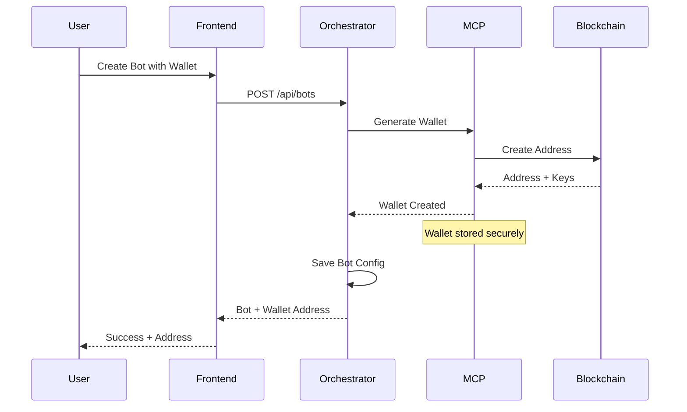
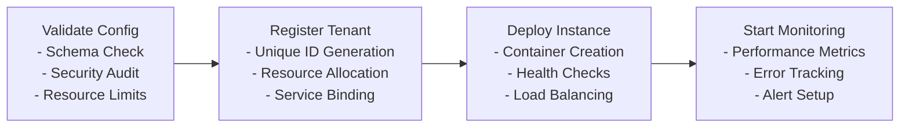

# Bot Builder Tutorial

Learn how to create, configure, and deploy your first AI bot on the Midnight blockchain using MidnightOS.

## Overview

The MidnightOS Bot Builder provides a comprehensive interface for creating AI agents that can interact with the Midnight blockchain, manage wallets, and execute autonomous operations. This tutorial will guide you through the entire process from initial setup to deployment.

## Bot Architecture

```mermaid
graph TB
    subgraph "Bot Creation Flow"
        CONFIG["Bot Configuration<br/>- Name & Description<br/>- Personality Settings<br/>- Capabilities"]
        
        WALLET["Wallet Setup<br/>- Generate Address<br/>- Fund Wallet<br/>- Set Permissions"]
        
        DEPLOY["Deployment<br/>- Tenant Registration<br/>- Service Binding<br/>- Health Checks"]
        
        CONFIG --> WALLET
        WALLET --> DEPLOY
    end
    
    subgraph "Bot Runtime Architecture"
        TENANT["Tenant Instance<br/>Bot ID: {tenant-id}"]
        
        ELIZA["Eliza AI Engine<br/>- Natural Language<br/>- Decision Making<br/>- Action Execution"]
        
        MCP["MCP Interface<br/>- Wallet Operations<br/>- Blockchain Queries<br/>- Transaction Signing"]
        
        BLOCKCHAIN["Midnight Blockchain<br/>- ZK Transactions<br/>- Smart Contracts<br/>- Asset Management"]
        
        TENANT --> ELIZA
        ELIZA --> MCP
        MCP --> BLOCKCHAIN
    end
    
    style CONFIG fill:#e1f5fe
    style WALLET fill:#e8f5e9
    style DEPLOY fill:#fff3e0
    style TENANT fill:#f3e5f5
```



## Prerequisites

Before creating your first bot, ensure:

1. MidnightOS is running locally (see [Quick Start Guide](quickstart.md))
2. All services are healthy and accessible
3. You have access to the web dashboard at http://localhost:3003

## Step 1: Access the Bot Builder

### Navigate to Dashboard

1. Open your browser to http://localhost:3003
2. You should see the MidnightOS dashboard
3. Click on "Create New Bot" or navigate to `/bots/new`

### Authentication (If Required)

If authentication is enabled:
```bash
# Generate a test JWT token for development
curl -X POST http://localhost:3002/auth/login \
  -H "Content-Type: application/json" \
  -d '{"username": "developer", "password": "dev123"}'
```

## Step 2: Bot Configuration

### Basic Information

Fill out the bot creation form with the following details:

**Bot Name**: A unique identifier for your bot
- Example: `treasury-manager-bot`
- Constraints: alphanumeric, hyphens allowed, max 50 characters

**Display Name**: Human-readable name shown in the UI
- Example: `Treasury Manager`

**Description**: Brief explanation of the bot's purpose
- Example: `Autonomous DAO treasury management and governance bot`

**Bot Type**: Select from available templates
- `general`: General purpose conversational bot
- `treasury`: DAO treasury management bot
- `governance`: Voting and proposal management bot
- `defi`: DeFi operations and trading bot
- `custom`: Custom configuration

### Personality Configuration

Define how your bot behaves and responds:

```json
{
  "personality": {
    "name": "Treasury Manager",
    "role": "DAO Treasury Manager",
    "background": "Expert in decentralized finance and treasury management",
    "traits": [
      "analytical",
      "conservative with funds",
      "transparent in operations",
      "responsive to community needs"
    ],
    "communication_style": "professional but approachable",
    "decision_making": "data-driven with community input"
  }
}
```

### Capabilities Selection

Choose which features your bot should have:

- **Wallet Management**: Basic send/receive operations
- **Treasury Operations**: Multi-sig wallet management
- **Governance**: Proposal creation and voting
- **DeFi Integration**: Staking, swapping, yield farming
- **Notifications**: Discord/Telegram integration
- **Reporting**: Financial reports and analytics

## Step 3: Wallet Setup

### Wallet Generation Flow



### Wallet Configuration Options

**Automatic Generation** (Recommended for testing):
- System generates a new wallet automatically
- Private keys managed securely by MCP service
- Suitable for development and testing

**Import Existing Wallet**:
- Provide seed phrase or private key
- Useful for production deployments
- Requires manual key management

**Multi-Signature Wallet**:
- Configure multiple signers
- Set threshold for transactions
- Enhanced security for treasury bots

### Security Considerations

```bash
# Wallet security layers
┌─────────────────────────────────────┐
│ Application Layer                   │
│ - JWT Authentication               │
│ - Role-based Access Control       │
└─────────────────────────────────────┘
┌─────────────────────────────────────┐
│ MCP Service Layer                  │
│ - Encrypted Key Storage           │
│ - Transaction Signing             │
│ - Rate Limiting                   │
└─────────────────────────────────────┘
┌─────────────────────────────────────┐
│ Blockchain Layer                   │
│ - Zero-Knowledge Proofs           │
│ - Shielded Transactions          │
│ - Smart Contract Security        │
└─────────────────────────────────────┘
```

## Step 4: Advanced Configuration

### Environment Variables

For advanced bot configuration, you can set custom environment variables:

```bash
# Bot-specific configuration
BOT_MAX_TRANSACTION_AMOUNT=1000
BOT_DAILY_SPENDING_LIMIT=5000
BOT_GOVERNANCE_THRESHOLD=51
BOT_NOTIFICATION_WEBHOOK=https://discord.com/api/webhooks/...

# AI behavior tuning
ELIZA_RESPONSE_TIMEOUT=30000
ELIZA_CONTEXT_WINDOW=4096
ELIZA_TEMPERATURE=0.7
```

### Custom Plugins

Enable additional functionality through plugins:

```json
{
  "plugins": [
    {
      "name": "discord-integration",
      "config": {
        "bot_token": "your-discord-bot-token",
        "guild_id": "your-server-id"
      }
    },
    {
      "name": "price-oracle",
      "config": {
        "providers": ["chainlink", "pyth"],
        "update_frequency": "1h"
      }
    }
  ]
}
```

## Step 5: Testing Your Bot

### Local Testing

Before deployment, test your bot locally:

```bash
# Start a chat session with your bot
curl -X POST http://localhost:3002/api/bots/{bot-id}/chat \
  -H "Content-Type: application/json" \
  -d '{"message": "Hello, what can you do?"}'
```

### Test Scenarios

Create test scenarios to validate bot behavior:

**1. Basic Conversation Test**
```json
{
  "test": "basic_conversation",
  "inputs": [
    "Hello",
    "What is my wallet balance?",
    "Can you send 10 tokens to address xyz?"
  ],
  "expected_behaviors": [
    "greeting_response",
    "balance_query",
    "transaction_validation"
  ]
}
```

**2. Wallet Operations Test**
```bash
# Test wallet balance query
curl -X POST http://localhost:3002/api/bots/{bot-id}/chat \
  -d '{"message": "What is my current balance?"}'

# Test transaction simulation
curl -X POST http://localhost:3002/api/bots/{bot-id}/chat \
  -d '{"message": "Simulate sending 1 DUST to mid1234...5678"}'
```

**3. Error Handling Test**
```bash
# Test invalid address
curl -X POST http://localhost:3002/api/bots/{bot-id}/chat \
  -d '{"message": "Send tokens to invalid-address"}'

# Test insufficient funds
curl -X POST http://localhost:3002/api/bots/{bot-id}/chat \
  -d '{"message": "Send 1000000 tokens to mid1234...5678"}'
```

## Step 6: Bot Deployment

### Pre-deployment Checklist

- [ ] Bot configuration validated
- [ ] Wallet properly funded for operations
- [ ] Test scenarios passed
- [ ] Security settings configured
- [ ] Monitoring and alerting setup

### Deployment Process



### Deployment Commands

```bash
# Deploy bot to development environment
curl -X POST http://localhost:3002/api/bots/{bot-id}/deploy \
  -H "Content-Type: application/json" \
  -d '{"environment": "development"}'

# Check deployment status
curl http://localhost:3002/api/bots/{bot-id}/status

# View deployment logs
curl http://localhost:3002/api/bots/{bot-id}/logs
```

## Step 7: Monitoring and Management

### Bot Metrics Dashboard

Access real-time metrics at: http://localhost:3003/bots/{bot-id}/metrics

Key metrics to monitor:
- Message processing rate
- Response time
- Transaction success rate
- Wallet balance changes
- Error frequency

### Health Checks

```bash
# Bot health endpoint
GET /api/bots/{bot-id}/health

# Response format
{
  "status": "healthy",
  "uptime": "2h 15m 30s",
  "last_activity": "2024-01-15T10:30:00Z",
  "wallet_balance": "1250.50 DUST",
  "pending_transactions": 0,
  "errors_last_hour": 0
}
```

### Log Management

```bash
# View recent logs
curl http://localhost:3002/api/bots/{bot-id}/logs?limit=100

# Filter logs by level
curl http://localhost:3002/api/bots/{bot-id}/logs?level=error

# Export logs for analysis
curl http://localhost:3002/api/bots/{bot-id}/logs/export > bot-logs.json
```

## Common Bot Patterns

### Treasury Management Bot

```json
{
  "name": "dao-treasury-manager",
  "type": "treasury",
  "capabilities": [
    "multi_sig_operations",
    "governance_integration",
    "financial_reporting",
    "risk_management"
  ],
  "rules": [
    {
      "condition": "transaction_amount > 1000",
      "action": "require_governance_approval"
    },
    {
      "condition": "daily_spending > 5000",
      "action": "halt_transactions_and_notify"
    }
  ]
}
```

### Community Engagement Bot

```json
{
  "name": "community-moderator",
  "type": "general",
  "capabilities": [
    "discord_integration",
    "content_moderation",
    "member_engagement",
    "event_management"
  ],
  "integrations": [
    {
      "platform": "discord",
      "permissions": ["read_messages", "send_messages", "manage_roles"]
    }
  ]
}
```

### DeFi Trading Bot

```json
{
  "name": "defi-arbitrage-bot",
  "type": "defi",
  "capabilities": [
    "price_monitoring",
    "arbitrage_detection",
    "automated_trading",
    "risk_management"
  ],
  "strategies": [
    {
      "name": "cross_dex_arbitrage",
      "max_trade_size": "100",
      "min_profit_threshold": "0.5%"
    }
  ]
}
```

## Troubleshooting

### Common Issues

**1. Bot Not Responding**
```bash
# Check bot status
curl http://localhost:3002/api/bots/{bot-id}/status

# Restart bot
curl -X POST http://localhost:3002/api/bots/{bot-id}/restart
```

**2. Wallet Connection Issues**
```bash
# Test MCP connection
curl http://localhost:3001/health

# Verify wallet exists
curl http://localhost:3002/api/bots/{bot-id}/wallet
```

**3. Configuration Errors**
```bash
# Validate bot configuration
curl -X POST http://localhost:3002/api/bots/validate \
  -H "Content-Type: application/json" \
  -d @bot-config.json
```

### Debug Mode

Enable verbose logging for troubleshooting:

```bash
# Set debug environment
DEBUG=midnightos:* pnpm dev

# Or for specific service
DEBUG=eliza:* cd services/eliza-agent && pnpm start:server
```

## Next Steps

After creating your first bot:

1. Explore [Treasury Setup](treasury.md) for DAO management
2. Review [Deployment Guide](deployment.md) for production deployment
3. Check out advanced bot templates in the examples directory

## API Reference

### Bot Management Endpoints

```bash
# Create bot
POST /api/bots
{
  "name": "string",
  "type": "string",
  "config": {}
}

# Get bot details
GET /api/bots/{id}

# Update bot configuration
PUT /api/bots/{id}
{
  "config": {}
}

# Delete bot
DELETE /api/bots/{id}

# Chat with bot
POST /api/bots/{id}/chat
{
  "message": "string",
  "context": {}
}
```

### Wallet Operations

```bash
# Get wallet balance
GET /api/bots/{id}/wallet/balance

# Send transaction
POST /api/bots/{id}/wallet/send
{
  "to": "address",
  "amount": "number",
  "memo": "string"
}

# Transaction history
GET /api/bots/{id}/wallet/transactions
```