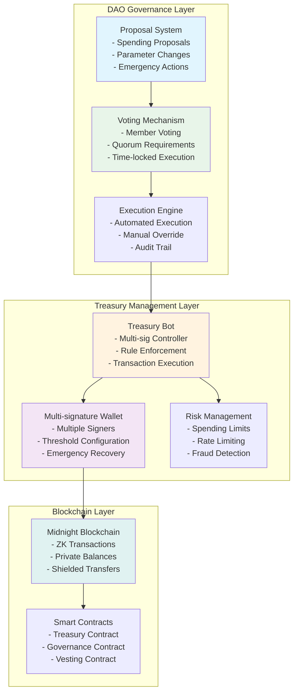
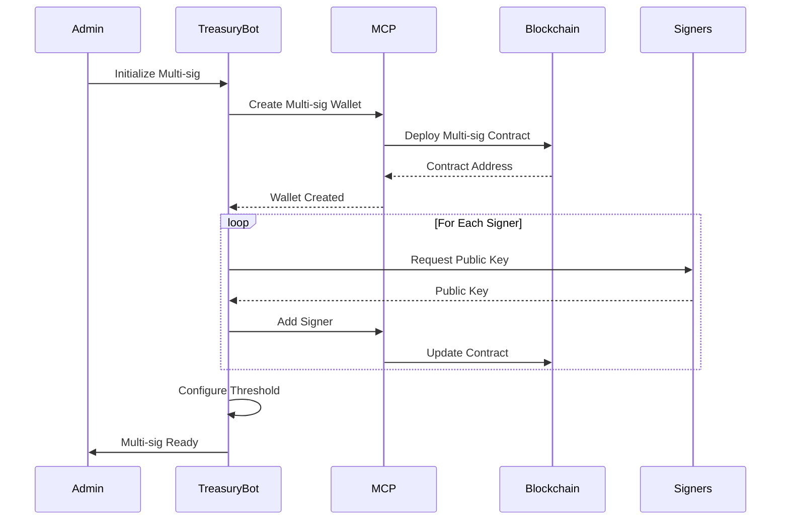
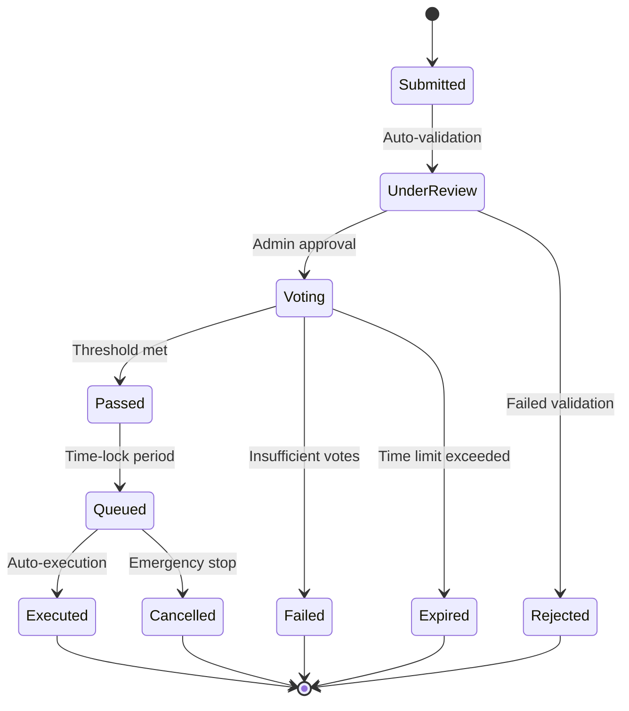
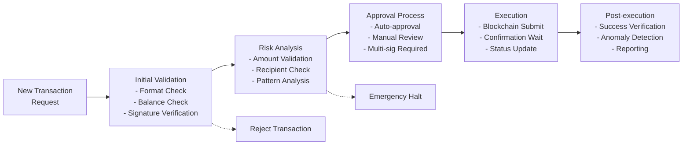
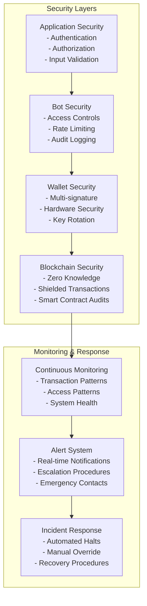

# Treasury Setup Guide

Configure autonomous treasury management for DAOs using MidnightOS smart bots with zero-knowledge privacy on the Midnight blockchain.

## Overview

MidnightOS Treasury Management enables DAOs to automate financial operations while maintaining transparency and security. This guide covers setting up treasury bots, configuring governance rules, and managing multi-signature wallets.

## Treasury Architecture



## Prerequisites

Before setting up treasury management:

1. MidnightOS platform running (see [Quick Start Guide](quickstart.md))
2. Created a treasury management bot (see [Bot Builder Tutorial](bot-builder.md))
3. DAO governance structure defined
4. Initial treasury funds available

## Step 1: Treasury Bot Configuration

### Create Treasury Bot

Start by creating a specialized treasury management bot:

```bash
# Create treasury bot via API
curl -X POST http://localhost:3002/api/bots \
  -H "Content-Type: application/json" \
  -d '{
    "name": "dao-treasury-manager",
    "type": "treasury",
    "description": "Autonomous DAO treasury management bot",
    "config": {
      "treasury_type": "multi_sig",
      "governance_integration": true,
      "risk_management": true,
      "reporting": true
    }
  }'
```

### Treasury Bot Configuration

```json
{
  "treasury_config": {
    "name": "Community DAO Treasury",
    "description": "Manages community funds and DAO operations",
    
    "governance": {
      "proposal_threshold": "1000", // Minimum tokens to create proposal
      "voting_period": "7d",        // Voting duration
      "execution_delay": "2d",      // Time-lock delay
      "quorum_percentage": 30,      // Minimum participation
      "approval_threshold": 51      // Percentage required to pass
    },
    
    "spending_limits": {
      "daily_limit": "10000",       // Max daily spending
      "monthly_limit": "100000",    // Max monthly spending
      "single_tx_limit": "50000",   // Max single transaction
      "emergency_limit": "5000"     // Emergency spending without approval
    },
    
    "multi_sig": {
      "threshold": 3,               // Signatures required
      "total_signers": 5,           // Total number of signers
      "emergency_threshold": 2,     // Emergency action threshold
      "recovery_threshold": 4       // Recovery threshold
    },
    
    "automation_rules": [
      {
        "name": "automated_staking",
        "condition": "idle_balance > 50000",
        "action": "stake_excess_funds",
        "parameters": {
          "keep_liquid": "10000",
          "staking_protocol": "midnight_staking"
        }
      },
      {
        "name": "emergency_halt",
        "condition": "daily_spending > daily_limit * 0.8",
        "action": "require_manual_approval",
        "parameters": {
          "notification_channels": ["discord", "email"]
        }
      }
    ]
  }
}
```

## Step 2: Multi-Signature Wallet Setup

### Wallet Generation Flow



### Configure Multi-Signature Wallet

```bash
# Initialize multi-signature wallet
curl -X POST http://localhost:3002/api/bots/{treasury-bot-id}/wallet/multisig \
  -H "Content-Type: application/json" \
  -d '{
    "threshold": 3,
    "signers": [
      {
        "name": "President",
        "address": "mid1abc...123",
        "role": "primary"
      },
      {
        "name": "Treasurer", 
        "address": "mid1def...456",
        "role": "financial"
      },
      {
        "name": "Secretary",
        "address": "mid1ghi...789",
        "role": "administrative"
      },
      {
        "name": "Community Rep 1",
        "address": "mid1jkl...012",
        "role": "community"
      },
      {
        "name": "Community Rep 2",
        "address": "mid1mno...345", 
        "role": "community"
      }
    ],
    "emergency_contacts": [
      "mid1xyz...999"
    ]
  }'
```

### Signer Management

```bash
# Add new signer
curl -X POST http://localhost:3002/api/bots/{treasury-bot-id}/wallet/multisig/signers \
  -d '{
    "address": "mid1new...signer",
    "name": "New Board Member",
    "role": "board"
  }'

# Remove signer (requires threshold signatures)
curl -X DELETE http://localhost:3002/api/bots/{treasury-bot-id}/wallet/multisig/signers/{signer-address}

# Update threshold
curl -X PUT http://localhost:3002/api/bots/{treasury-bot-id}/wallet/multisig/threshold \
  -d '{"new_threshold": 4}'
```

## Step 3: Governance Integration

### Proposal System

Configure automated proposal handling:

```json
{
  "governance_config": {
    "proposal_types": [
      {
        "type": "spending",
        "max_amount": "100000",
        "required_info": ["recipient", "amount", "purpose", "timeline"],
        "approval_process": "standard_voting"
      },
      {
        "type": "parameter_change",
        "parameters": ["spending_limits", "threshold", "voting_period"],
        "approval_process": "super_majority"
      },
      {
        "type": "emergency",
        "max_amount": "10000", 
        "approval_process": "fast_track",
        "time_limit": "24h"
      }
    ],
    
    "voting_mechanisms": {
      "standard_voting": {
        "duration": "7d",
        "quorum": "30%",
        "threshold": "51%"
      },
      "super_majority": {
        "duration": "10d", 
        "quorum": "40%",
        "threshold": "67%"
      },
      "fast_track": {
        "duration": "24h",
        "quorum": "20%",
        "threshold": "75%"
      }
    }
  }
}
```

### Proposal Workflow



### Automated Proposal Execution

```bash
# Example: Automated spending proposal execution
{
  "proposal_id": "prop_001",
  "type": "spending",
  "details": {
    "recipient": "mid1dev...team",
    "amount": "25000",
    "purpose": "Development milestone payment",
    "justification": "Completed smart contract audit and testing"
  },
  "voting_result": {
    "total_votes": 1250000,
    "yes_votes": 850000,
    "no_votes": 400000,
    "approval_percentage": 68,
    "quorum_met": true
  },
  "execution": {
    "scheduled_time": "2024-01-20T10:00:00Z",
    "auto_execute": true,
    "requires_signatures": 3
  }
}
```

## Step 4: Risk Management Configuration

### Spending Controls

```json
{
  "risk_management": {
    "spending_controls": {
      "daily_limits": {
        "operational": "5000",
        "development": "10000", 
        "marketing": "3000",
        "emergency": "2000"
      },
      
      "velocity_controls": {
        "max_transactions_per_hour": 10,
        "max_transactions_per_day": 50,
        "cool_down_period": "1h"
      },
      
      "recipient_validation": {
        "whitelist_required": true,
        "blacklist_check": true,
        "new_recipient_approval": true
      }
    },
    
    "monitoring": {
      "unusual_activity_threshold": 2.0, // Standard deviations
      "large_transaction_threshold": "50000",
      "frequency_monitoring": true,
      "pattern_analysis": true
    },
    
    "emergency_procedures": {
      "auto_halt_conditions": [
        "spending_velocity_exceeded",
        "unknown_recipient_large_amount",
        "governance_system_compromise"
      ],
      "manual_halt_signers": 2,
      "recovery_process": "multi_sig_recovery"
    }
  }
}
```

### Fraud Detection



## Step 5: Treasury Operations

### Daily Operations

Common treasury operations that can be automated:

```bash
# Check treasury balance
curl http://localhost:3002/api/bots/{treasury-bot-id}/treasury/balance

# View pending transactions
curl http://localhost:3002/api/bots/{treasury-bot-id}/treasury/pending

# Execute approved proposal
curl -X POST http://localhost:3002/api/bots/{treasury-bot-id}/treasury/execute/{proposal-id}

# Generate financial report
curl http://localhost:3002/api/bots/{treasury-bot-id}/treasury/report?period=monthly
```

### Automated Operations

Configure recurring operations:

```json
{
  "automated_operations": [
    {
      "name": "monthly_staking",
      "schedule": "0 0 1 * *", // First day of month
      "action": "stake_idle_funds",
      "conditions": {
        "min_balance": "100000",
        "keep_liquid": "20000"
      }
    },
    {
      "name": "weekly_reports",
      "schedule": "0 9 * * 1", // Monday 9 AM
      "action": "generate_report",
      "recipients": ["board@dao.org", "community@dao.org"]
    },
    {
      "name": "governance_notifications",
      "schedule": "0 */6 * * *", // Every 6 hours
      "action": "check_proposals",
      "notify_on": ["new_proposal", "voting_deadline", "execution_ready"]
    }
  ]
}
```

### Emergency Procedures

```bash
# Emergency halt (requires 2 signatures)
curl -X POST http://localhost:3002/api/bots/{treasury-bot-id}/emergency/halt \
  -H "Authorization: Bearer {signature1}" \
  -H "X-Emergency-Signature: {signature2}" \
  -d '{"reason": "Suspected security breach"}'

# Emergency fund access
curl -X POST http://localhost:3002/api/bots/{treasury-bot-id}/emergency/access \
  -d '{
    "amount": "5000",
    "recipient": "mid1emergency...address", 
    "justification": "Critical infrastructure maintenance"
  }'

# Resume operations
curl -X POST http://localhost:3002/api/bots/{treasury-bot-id}/emergency/resume \
  -H "Authorization: Bearer {admin-signature}"
```

## Step 6: Reporting and Analytics

### Financial Reports

```json
{
  "monthly_report": {
    "period": "2024-01",
    "summary": {
      "opening_balance": "500000",
      "total_income": "75000",
      "total_expenses": "45000", 
      "closing_balance": "530000",
      "net_change": "+30000"
    },
    
    "income_breakdown": [
      {"source": "token_sales", "amount": "50000"},
      {"source": "staking_rewards", "amount": "15000"},
      {"source": "treasury_yield", "amount": "10000"}
    ],
    
    "expense_breakdown": [
      {"category": "development", "amount": "25000"},
      {"category": "operations", "amount": "12000"},
      {"category": "marketing", "amount": "8000"}
    ],
    
    "governance_activity": {
      "proposals_submitted": 8,
      "proposals_passed": 6,
      "proposals_failed": 2,
      "average_participation": "45%"
    }
  }
}
```

### Performance Metrics

```bash
# Treasury performance dashboard
curl http://localhost:3002/api/bots/{treasury-bot-id}/metrics

# Response includes:
{
  "performance": {
    "uptime": "99.8%",
    "transaction_success_rate": "99.5%",
    "average_approval_time": "4.2h",
    "governance_participation": "42%"
  },
  
  "security": {
    "failed_authentication_attempts": 0,
    "suspicious_transactions_blocked": 3,
    "emergency_halts_triggered": 0,
    "last_security_audit": "2024-01-15"
  },
  
  "efficiency": {
    "automated_operations_success": "98%",
    "manual_interventions_required": 12,
    "cost_savings_vs_manual": "78%"
  }
}
```

## Step 7: Integration Examples

### Discord Integration

```json
{
  "discord_integration": {
    "bot_token": "your-discord-bot-token",
    "guild_id": "your-server-id",
    
    "channels": {
      "proposals": "123456789",
      "treasury": "234567890", 
      "governance": "345678901"
    },
    
    "notifications": [
      {
        "event": "new_proposal",
        "channel": "proposals",
        "template": "🗳️ New proposal #{proposal_id}: {title}\nAmount: {amount}\nVoting ends: {deadline}"
      },
      {
        "event": "large_transaction",
        "channel": "treasury",
        "template": "💰 Large transaction executed: {amount} to {recipient}\nProposal: #{proposal_id}"
      }
    ],
    
    "commands": [
      {
        "command": "/balance",
        "description": "Check treasury balance",
        "permissions": ["treasury_viewer"]
      },
      {
        "command": "/proposals",
        "description": "List active proposals", 
        "permissions": ["member"]
      }
    ]
  }
}
```

### API Webhooks

```bash
# Configure external webhooks for treasury events
curl -X POST http://localhost:3002/api/bots/{treasury-bot-id}/webhooks \
  -d '{
    "url": "https://your-dao.org/api/treasury/webhook",
    "events": [
      "proposal_created",
      "proposal_executed", 
      "large_transaction",
      "emergency_halt"
    ],
    "secret": "webhook-secret-key"
  }'
```

## Security Best Practices

### Multi-layer Security



### Security Checklist

- [ ] Multi-signature wallet properly configured
- [ ] All signers verified and secure
- [ ] Spending limits appropriate for organization size
- [ ] Emergency procedures documented and tested
- [ ] Regular security audits scheduled
- [ ] Backup and recovery procedures in place
- [ ] Monitoring and alerting configured
- [ ] Incident response plan established

## Troubleshooting

### Common Issues

**1. Multi-sig Transaction Failures**
```bash
# Check signer availability
curl http://localhost:3002/api/bots/{treasury-bot-id}/wallet/multisig/signers/status

# Verify transaction details
curl http://localhost:3002/api/bots/{treasury-bot-id}/wallet/transactions/{tx-id}
```

**2. Governance Voting Issues**
```bash
# Check proposal status
curl http://localhost:3002/api/bots/{treasury-bot-id}/governance/proposals/{proposal-id}

# Verify voting eligibility
curl http://localhost:3002/api/bots/{treasury-bot-id}/governance/voters/{address}/eligibility
```

**3. Risk Management Alerts**
```bash
# View recent alerts
curl http://localhost:3002/api/bots/{treasury-bot-id}/risk/alerts

# Check spending patterns
curl http://localhost:3002/api/bots/{treasury-bot-id}/risk/analysis
```

## Next Steps

After setting up treasury management:

1. Review [Deployment Guide](deployment.md) for production deployment
2. Set up monitoring and alerting systems
3. Train DAO members on governance procedures
4. Schedule regular security audits
5. Plan for system upgrades and maintenance